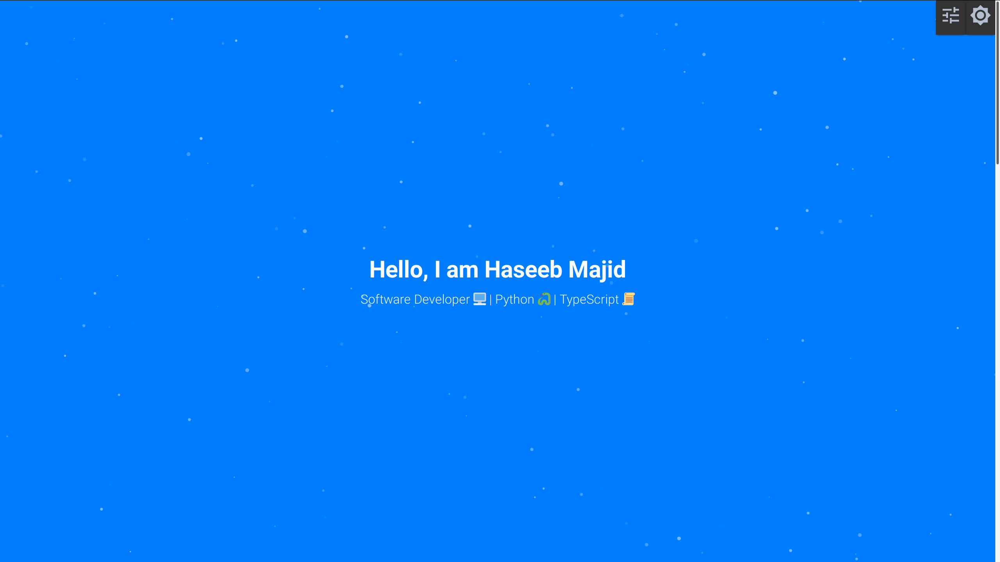

[](https://gitlab.com/hmajid2301/personal-site/commits/master)
[](https://gitlab.com/hmajid2301/personal-site/commits/master)
[](https://app.netlify.com/sites/inspiring-tesla-e1acd1/deploys)
[](https://percy.io/b2e6b2bc/personal-site)

- [🎉 Introduction](#-introduction)
- [✨ Development](#-development)
  - [⛑️ Linting](#️-linting)
  - [🩺 Testing](#-testing)
  - [📦 Deployment](#-deployment)
- [🎉 Features](#-features)
  - [📚 Storybook](#-storybook)
  - [⛵️ Lighthouse score](#️-lighthouse-score)
  - [⚛️ Atomic Design](#️-atomic-design)
  - [🗂 Config](#-config)
    - [🔧 config](#-config-1)
    - [🌳 .env](#-env)
  - [🌞/🌝 Themes switcher](#-themes-switcher)
  - [🔎 SEO component](#-seo-component)
  - [📈 GoatCounter analytics tracking](#-goatcounter-analytics-tracking)
  - [🖼️ Social Media Sharing Cards](#️-social-media-sharing-cards)
  - [💚 Gitlab CI](#-gitlab-ci)
  - [📝 Uses Page](#-uses-page)
  - [📃 Markdown](#-markdown)
    - [Frontmatter](#frontmatter)
    - [Code Blocks](#code-blocks)
    - [Admonitions](#admonitions)
- [🏚️ Previous Versions](#️-previous-versions)
- [🔚 Appendix](#-appendix)
  - [🖼️ Inspired By](#️-inspired-by)

---

## 🎉 Introduction

This is my [personal portfolio](https://haseebmajid.dev) site is built using [Gatsby](https://gatsbyjs.org).
The app uses the following technologies and libraries:

- Gatsby
- Typescript
- TailwindCSS/EmotionJS
- Storybook
- Netlify
- Gitlab CI

## ✨ Development

You can run the application locally using either `docker` (docker-compose) or `yarn`.

```bash
git clone git@github.com:hmajid2301/personal-site.git
cd personal-site/

# docker
docker-compose up --build

# locally
yarn
yarn develop

# Open at localhost:8000
```

### ⛑️ Linting

ESlint & Prettier:

```bash
yarn run lint
yarn run format
```

### 🩺 Testing

To run all tests:

```bash
yarn run test
```

### 📦 Deployment

This application is currently deployed to [`Netlify`](netlify.com) it is deployed using gitlab CI to deploy the site.

## 🎉 Features

You can easily take this portfolio site and configure it for your own use!

### 📚 Storybook

The application comes with storybook ready to use you just need to edit the `*.stories.mdx` files within the component
folders. You can create your storybook website using: `yarn run storybook`.

### ⛵️ Lighthouse score


### ⚛️ Atomic Design

This project has tried to follow the atomic design as laid out by
[Brad Frost here](https://bradfrost.com/blog/post/atomic-web-design/). Essentially
we try to breakdown components into different sections depending on their level of
abstraction.

### 🗂 Config

There are a few ways to configure the project.

#### 🔧 config

There is one main config file, `config/config.json` which contains all configurable data for the site. This includes what projects to show, which (Gitlab/Github) repo's to show
and even the text in the `hero` panel.

One key config field is which git repo to fetch the article data from. I prefer
to keep my articles in a separate repo to the blog, so the articles get "imported" at
build time via a gatsby plugin
[`gatsby-source-git`](https://github.com/stevetweeddale/gatsby-source-git).

#### 🌳 .env

Alongside the config file we also have a `.env` file which stores some config values
use by `gatsby-config.js`. You can look at the `.env.sample` file to see what format
it expects the file to be in.

### 🌞/🌝 Themes switcher

Swap themes from dark to the light mode it uses a `ThemeProvider` which stores the current theme in `localstorage` and remembers it the next time a user visits your site. To
customise the theme colours edit the `styles/global.css` file. The main colours are set in
`.root, #root` and the specific light/dark mode colours are set in `.theme-light` and
`.theme-dark` respectively.

### 🔎 SEO component

Includes an SEO component which automatically includes all the metadata required for
FB, Twitter and Open Graph images. By default, it uses the `static/og-image.jpg` unless
it's a blog post with a cover image.

### 📈 GoatCounter analytics tracking

The site sends usage statistics to [GoatCounter](https://www.goatcounter.com/) all you have to do is create an account. You can see the data for [`haseebmajid.dev`](https://haseebmajid.goatcounter.com/), it's available for everyone to see!

### 🖼️ Social Media Sharing Cards

Social media sharing card such as open graph images are also auto generated for each blog post. You can edit the image here `plugins/gatsby-plugin-social-sharing-cards/templates/default.png`. The image used for everywhere else can be found here `static/og-image.jpg`.
You will need to adjust those accordingly.

### 💚 Gitlab CI

We have a `.gitlab-ci.yml`, which will provide jobs to run various linting jobs, e2e tests
and building the site and publishing to Netlify. It needs the following environment variables
passed as CI variables:

- GOATCOUNTER_CODE
- NETLIFY_PERSONAL_TOKEN
- NETLIFY_SITE_ID
- PERCY_TOKEN

### 📝 Uses Page

Inspired by the [uses.tech](https://uses.tech/) site. Add your own `/uses/` all you need to do it
update the file at `src/content/uses.md` to include what you use.

### 📃 Markdown

Each blog post is created from a markdown file!

#### Frontmatter

Where the frontmatter should look something like this.

```md
---
title: "Add an 'edit post' button to your Gatsby blog"
tags: ['gatsby', 'react', 'git', 'javascript']
slug: 'gatsby-edit-button'
canonical_url: 'https://haseebmajid.dev/blog/gatsby-edit-button/'
date: '2020-09-07'
cover_image: 'images/cover.jpg'
---
```

#### Code Blocks

You can give code blocks titles like so:

````md
\```js:title=gatsby-config.js
{
resolve: `gatsby-transformer-remark`,
options: {
// ...
},
},
\```
````

You can import code locally like so:

````md
\```python:title=src/test_api/run.py file=./source_code/test-api/src/test_api/run.py

\```
````

#### Admonitions

You can add admonitions like so:

```md
:::tip pro tip
remark-admonitions is pretty great!
:::
```

## 🏚️ Previous Versions

<p align="center">
  <a href="https://v1.haseebmajid.dev" target="_blank">
    
  </a>
  <a href="https://v2.haseebmajid.dev" target="_blank">
    
  </a>
</p>

## 🔚 Appendix

### 🖼️ Inspired By

- Project template by [duncanleung](https://github.com/duncanleung/gatsby-typescript-emotion-storybook)
- [Treact](https://treact.owaiskhan.me)
- [Matthias Kretschmann](https://matthiaskretschmann.com/)
- [Paul Scanlon](https://paulie.dev/posts/)
- Open Graph Image from [here](https://codeburst.io/how-to-automate-social-sharing-cards-on-your-gatsby-blog-77a356a58b38)
